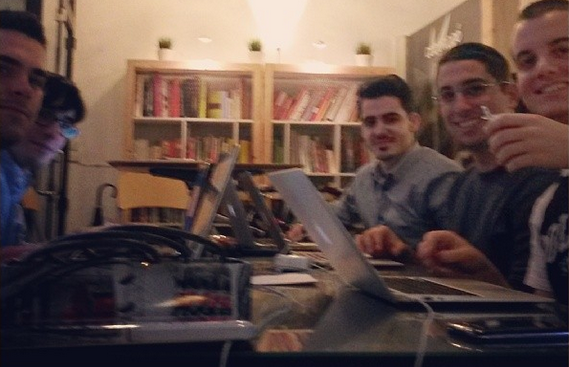

Práctica Cocorocó IV/DAI - Cafeteros
====================================

## ¿Quiénes somos?

- José Miguel Colella Carbonara [@josecolella](https://github.com/josecolella)

- Javier Collado López [@javiercollado](https://github.com/javiercollado)

- Antonio Ángel Guirola Vicente [@antonioguirola](https://github.com/antonioguirola)

- Sergio Muñoz Gamarra [@sergiomgamarra](https://github.com/)

- Francisco Ruíz López [@elmendacorp](https://github.com/elmendacorp)




## Descripción

El objetivo de este proyecto es facilitar la supervisión remota de máquinas de vending de café. Actualmente el usuario tiene que acudir físicamente al lugar donde se encuentra la máquina y conectar su ordenador mediante puerto serie para leer la información de los distintos sensores de las mismas. Nuestra misión es leer la información de las máquinas y transmitirla a un sitio web de forma que el usuario pueda consultar desde cualquier lugar el estado de las mismas.


## Interpretación del problema

En la reunión del equipo tras evaluar lo que el cliente necesitaba empezamos dividiendo el problema en dos partes: una sería la creación de una aplicación web que interpretase los datos y se los mostrara al cliente de una manera simple y amena para conocer el estado de la red de máquinas y por otra parte una interfaz con el equipo de vending; nuestra primera impresión fue usar una Raspberry pi o un microcontrolador arduino.

Lo que necesitábamos saber es cómo se interpretan los datos de la maquina por parte del cliente, ya sea por algún protocolo en particular o si se necesitaba alguna interacción especial con el equipo.


## Entrevista con el cliente

Tras reunirnos con el cliente para ver cuáles eran sus necesidades se aclararon algunos de los puntos que teníamos en duda, en particular la interfaz con la máquina y las características que debían mostrarse en el sitio web.

En primer lugar nos explicó que la máquina requiere pulsar una serie de botones para realizar las acciones de mantenimiento, con lo que decidimos crear una interfaz mediante una raspberry pi usando los pines GPIO y unos relés para evitar posibles picos de tensión para la placa.

El equipo estaría conectado a Internet ya sea por wifi o por la red 3g, dependiendo de las ubicaciones de las máquinas.

La idea era crear pequeños scripts que realizaran lo pertinente en la maquina, lo cual crearía una capa de abstracción entre el cliente y las mismas, siendo el modelo de éstas independiente para la plataforma que estamos creando.

En cuanto a la interfaz web nos pidió ciertos requisitos mínimos, como una pantalla de autentificación en primer lugar, y luego un panel de administración para controlar las máquinas.

Las funcionalidades deseadas eran las de poder conocer el estado de las máquinas, así como reiniciarlas o activar la función de limpiado de las mismas, aunque disponiendo de control de todos los botones de la misma se podría hacer cualquier cosa.


## Diseño y maquetación del proyecto

Tras cconversar con el cliente estuvimos decidiendo cómo realizar todo el proyecto y qué cosas serían necesarias para que todo fuera bien, o al menos para hacernos una idea de como sería el producto final.

Para la parte del cliente crearíamos una aplicación para centralizar los servicios, utilizando el SaaS OpenShift, a la cual las máquinas accederían y actualizarían su estado. Utilizando las tecnologías PHP, CSS y Python tendríamos la parte del servidor completa, usando para la base de datos MySQL. En el aspecto gráfico usaríamos Twitter Bootstrap para gestionar los estilos y hacer un diseño responsive que funcionara en cualquier dispositivo.

En cuanto a la raspberry pi usaríamos el lenguaje Python para programar los scripts que se ejecutarían en ella, ya que los drivers para interactuar con los pines de la placa están disponibles en varios lenguajes, como Java, pero Python es ligero y de aplicación para la asignatura de DAI.


## Funcionalidad extra

Aparte del proyecto planteamos ciertos aspectos que se podrían incluir en el mismo pero, que dado el espacio de tiempo del que disponemos, no serian posibles de realizar.
Analizando la parte del servidor, ya que tendríamos un acceso abstracto a la maquina, teneniendo acceso a los botones de la misma, podríamos tener acceso a toda la funcionalidad, como por ejemplo, realizar desde una web una interfaz para comprar un café y pagarlo por paypal, y que la maquina lo sirviera.
Respecto a la parte de hardware se podría añadir el control del monedero, pero dado que la empresa propietaria no indican muy bien protocolos e información del funcionamiento, no podemos saber como funciona muy bien, pero seria posible. La idea era crear scripts que activaran funcionalidades al ser llamados de manera remota.


## Fase de desarrollo

En esta parte dividiremos en dos las ramas en las que avanza el proyecto, una seria la de hardware y otra la se de software.
La parte de hardware desarrolla un sistema para leer e interactuar con la maquina con los botones.
la parte de sofware desarrolla una interfaz web y ademas de algunos scripts para manejar los ficheros de la maquina.

La parte de hardware usa una raspberry pi usando la librería GPIO, mediante un script en python activamos la secuencia de los botones de la maquina, otro script pone un puerto serial en escucha para recibir la entrada de datos y escribirla en un fichero plano.


###Parsing y Conexión Remota con las bases de datos en OpenShift

En esta sección se denota el proceso de coger el fichero que saca
la máquina de cafe, procesar dicho fichero para que la información
pueda ser mandada a las bases de datos de Openshift. Este último proceso
se hace remotamente y de manera segura.

El fichero que hay que procesar tiene información sobre:
  - Nombre del Fabricante
  - Modelo
  - Revision del fireware de la máquina
  - Codigo de la máquina
  - Número de Impresion
  - Contador de todos los cafes del inicio
  - Los diferentes cafes con la informacion de la venta
  que corresponde al cafe que se ha vendido
  - La maquina emite 8 precios diferentes.
  - Averias de la maquina

El objetivo a cumplir era estructurar dicha información de una manera que
si se ve en un futuro se pueda manipular más facilmente, y además que dicha
información se vaya alojando en la aplicación web para que pueda ser visualizada
por cualquier persona que necesite administrar las máquinas de cafe.

El primer objetivo que se ha planteado se ha tratado de cumplir estructurando
los datos proporcionados de dichos fichero en forma de un fichero json. JSON
es una alternativo a XML para el intercambio de información. Son estructuras fácil
de entender y manejar.

A continuación podemos el resultado de transformar la información proporcionada
de la máquina en un fichero JSON que esta denotado por el fecha y el tiempo en
el cual se ha hecho el análisis.


```json
{
    "Codigo de la Maquina": "0001",
    "Contador de todos los cafes del inicio del tiempo": "1224",
    "Errores": [
        {
            "1": "0"
        },
        {
            "2": "0"
        },
        {
            "3": "5"
        },
        {
            "4": "0"
        },
        {
            "5": "3"
        },
        {
            "6": "1"
        },
        {
            "7": "0"
        },
        {
            "8": "0"
        },
        {
            "9": "0"
        },
        {
            "10": "7"
        },
        {
            "11": "0"
        },
        {
            "12": "0"
        },
        {
            "13": "0"
        },
        {
            "14": "0"
        },
        {
            "15": "0"
        }
    ],
    "Modelo": "D.A. COLIBRI",
    "Nombre de Fabricante": "NECTA VENDING",
    "Numero de Impresion": "17",
    "Precio": [
        {
            "1": "1217"
        },
        {
            "2": "0"
        },
        {
            "3": "0"
        },
        {
            "4": "0"
        },
        {
            "5": "0"
        },
        {
            "6": "0"
        },
        {
            "7": "0"
        },
        {
            "8": "0"
        }
    ],
    "Revision del Firmware": "Rev. 1.9 LVZ",
    "Tecla": [
        {
            "1": [
                "0",
                "0",
                "0"
            ]
        },
        {
            "2": [
                "32",
                "4",
                "0"
            ]
        },
        {
            "3": [
                "80",
                "0",
                "0"
            ]
        },
        {
            "4": [
                "38",
                "0",
                "0"
            ]
        },
        {
            "5": [
                "0",
                "0",
                "0"
            ]
        },
        {
            "6": [
                "270",
                "1",
                "0"
            ]
        },
        {
            "7": [
                "282",
                "3",
                "0"
            ]
        },
        {
            "8": [
                "506",
                "1",
                "0"
            ]
        }
    ],
    "Vaso f.n.": "1217",
    "Vaso mant.": "0"
}
```


Para crear dicha estructura he usado Python, especificamente su modulo de json
para poder crear el fichero JSON. Lo primero que se ha hecho es crear un objeto
[`VendingMachine`][https://github.com/IV-GII/Cafeteros/blob/master/scripts/VendingMachine.py]
que encapsula la estructura y toda la información relacionada con la máquina de cafe que se esta tratando.

Para parsear el fichero y guardar la información relevante he usado el modulo de
expresiones regulares de python.

El script que hace todo el procedimiento es el siguiente:

```python
#!/usr/bin/env python3
# -*- coding: utf-8 -*-

import sys
from VendingMachine import *


if __name__ == '__main__':
    try:
        coffeeMachine = VendingMachine(sys.argv[1])
        coffeeMachine.saveToFile()
    except IndexError:
        print("Se requiere un argumento de linea de comando")
```

Se le pasa un argumento por linea. Dicho argumento es el fichero a parsear.
Cuando finaliza de procesar guarda la información en un fichero JSON.
Además que se va guardando información sobre cuando se hace el parseo guardando
información sobre la fecha y el tiempo en un fichero `tiempo.txt`.

Ahora llegamos al segundo objetivo que es la parte de transferir la información
remotamente desde el raspberry pi hasta las bases de datos de Openshift, para que
se pueda visualizar desde la aplicación web.

La única dependencia que se tiene que tener en cuenta es el modulo
para conectar python a MySQL. Dicho modulo se llama `MySQLdb`. Esto
se previente en el provisionamiento con ansible.

En dicho programa se tiene en cuenta cuatro tablas.
  - La tabla de las maquina, que diferencia las máquinas
  - El producto, que tiene en cuenta la máquina con sus diversos cafes
  - El precio que tiene la máquina
  - Los errores que esta ligado con la máquina

A continuación se puede ver las cuatro funciones creadas para insertar en las
bases de datos.

```python
def insertMachineInfo(id_maquina, model, firmware, fabricante, n_cafes, vasos_totales, vasos_mantenido, n_impresion):
    db.execute(
        """
        INSERT INTO maquinas VALUES (%s, %s, %s, %s, %s, %s, %s, %s)
        """,
        (id_maquina, model, firmware, fabricante, n_cafes, vasos_totales, vasos_mantenido, n_impresion))


def insertProduct(id_maquina, boton, pago, gratis, test):
    db.execute(
        """
        INSERT INTO Producto VALUES (%s, %s, %s, %s, %s)
        """,
        (id_maquina, boton, pago, gratis, test))


def insertPrice(id_maquina, precio1, precio2, precio3, precio4, precio5, precio6, precio7, precio8):
    db.execute(
        """
        INSERT INTO precio VALUES (%s,%s, %s, %s, %s, %s, %s, %s, %s)
        """,
        (id_maquina, precio1, precio2, precio3,
         precio4, precio5, precio6, precio7, precio8)
    )


def insertError(id_maquina, er1, er2, er3, er4, er5, er6, er7, er8, er9, er10, er11, er12, er13, er14, er15):
    db.execute(
        """
        INSERT INTO errores VALUES (%s, %s,%s, %s,%s, %s,%s, %s,%s, %s,%s, %s,%s, %s,%s, %s)
        """,
        (id_maquina, er1, er2, er3, er4, er5, er6, er7, er8, er9, er10, er11, er12, er13, er14, er15))

```

####Importante

Para poder hacer la conexión con las bases de datos en Openshift se tiene que usar
la funcionalidad que proporciona el cliente de Openshift **(rhc)** con port-forwarding.
Esto significa que el raspberry pi podra transferir todas la información a openshift
usando el host de localhost y usando un puerto dado que transfiere toda la información
a las bases de datos MySQL.

El script que gestiona la conexión e inserción en las bases de datos se puede
visualizar [aquí](https://github.com/IV-GII/Cafeteros/blob/master/scripts/databaseconn.py)


Ejecucion del programa:
A continuación podemos ver como se hace para procesar los ficheros y mandar la información a 
las bases de datos de OpenShift.

Primero se han parseado tres fichero proporcionados, con los siguientes comandos:

```bash
python3 fileparser.py captura\ 20140120\ iznalloz.txt
python3 fileparser.py captura\ 20140121\ tecnoszubia.txt
python3 fileparser.py captura\ 20140124\ cocoroco.txt
```

Segundo se ha conectado con las bases de datos con los siguientes comandos, donde
primero tiene que hacer el port-forwarding para conectarse y mandar la información

```bash
rhc port-forward -a cafeteros
```

Se termina la secuencia usando el siguiente comando:

```bash
python databaseconn.py
```

Esto graba todos los datos procesado en dicho día en las bases de datos.


Bibliografía
============
[Como enlazar mensajes a issues][1]
[Como conectarse de manera remota a las bases de datos en Openshift][2]

[1]: http://stackoverflow.com/questions/1687262/link-to-github-issue-number-with-commit-message
[2]: https://www.openshift.com/blogs/getting-started-with-port-forwarding-on-openshift
